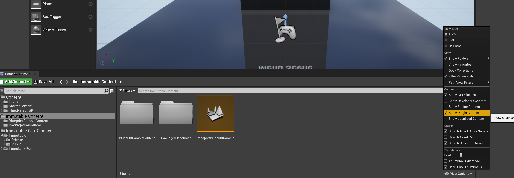

<div align="center">
  <p align="center">
    <a  href="https://docs.x.immutable.com/docs">
      
    </a>
  </p>
</div>

---

# Unreal Engine Sample Game

This Unreal Engine sample game demoes features provided by the <https://github.com/immutable/unreal-immutable-sdk> plugin. It is built with Unreal Engine 4.26 (the min Unreal Engine version the Unreal SDK supports), so the sample blueprints are compatible with newer versions of Unreal Engine.

## Cloning this Repo

> Before cloning this repo, ensure you have [git lfs](https://git-lfs.com/) installed.

This repo uses sub-modules, to clone including the correct sub-modules use the following command:

```bash
git clone --recurse-submodules git@github.com:immutable/sample-unreal-game.git
```

To pull new changes after cloned use the following command:

```bash
git pull --recurse-submodules
```

The submodules include the [BLUI](https://github.com/immutable/immutable-BLUI) and [unreal-immutable-sdk](https://github.com/immutable/unreal-immutable-sdk) repositories, which get cloned into the `Plugins` directory with the correct plugin settings configured for BLUI and the Unreal SDK to work out of the box without additional setup steps.

# Running the Game

## Pre-requisites

* Unreal Engine 4.26 (or newer)
* Visual Studio 2019

## Quick Start

After cloning the repo, double click the `SampleGame426` uproject file in the file explorer will build the project and launch Unreal Engine 4.26.

## Enable Plugin Content



- Open the `Content Browser`
- Click on `View Options` button in the bottom right corner of the `Content Browser` window
- Select `Show Plugin Content`

The `Immutable Content` folder includes sample blueprints from the `unreal-immutable-sdk` plugin.

## BLUI

For Unreal Engine 4.26 and 4.27, the Unreal SDK use BLUI plugin instead of `WebBrowserWidget` plugin. Normally when installing the Unreal SDK into a project there are additional requirements for setting up BLUI. This project comes with the `WebBroswerWidget` and BLUI setup correctly and should work without any additional configuration.

More information about BLUI can be found on the [Unreal SDK installation](https://docs.immutable.com/sdks/zkEVM/unreal#installation) docs.

## Changelog Management

The following headings should be used as appropriate.

- Added
- Changed
- Deprecated
- Removed
- Fixed

What follows is an example with all the change headings, for real world use only use headings when appropriate.
This goes at the top of the CHANGELOG.md above the most recent release.

```markdown
...

## [Unreleased]

### Added

for new features.

### Changed

for changes in existing functionality.

### Deprecated

for soon-to-be removed features.

### Removed

for now removed features.

### Fixed

for any bug fixes.

...
```

## Contributing

If you would like to contribute, please read the following:

- We use the [Conventional Commits specification](https://www.conventionalcommits.org/en/v1.0.0/#specification) when writing our commit messages. Why use Conventional Commits? Read [here](https://www.conventionalcommits.org/en/v1.0.0/#why-use-conventional-commits).

## Getting Help

Immutable X is open to all to build on, with no approvals required. If you want to talk to us to learn more, or apply for developer grants, click below:

[Contact us](https://www.immutable.com/contact)

### Project Support

To get help from other developers, discuss ideas, and stay up-to-date on what's happening, become a part of our community on Discord.

[Join us on Discord](https://discord.gg/TkVumkJ9D6)

You can also join the conversation, connect with other projects, and ask questions in our Immutable X Discourse forum.

[Visit the forum](https://forum.immutable.com/)

#### Still need help?

You can also apply for marketing support for your project. Or, if you need help with an issue related to what you're building with Immutable X, click below to submit an issue. Select _I have a question_ or _issue related to building on Immutable X_ as your issue type.

[Contact support](https://support.immutable.com/hc/en-us/requests/new)

## License
Immutable Unity SDK repository is distributed under the terms of the [Apache License (Version 2.0)](LICENSE).
